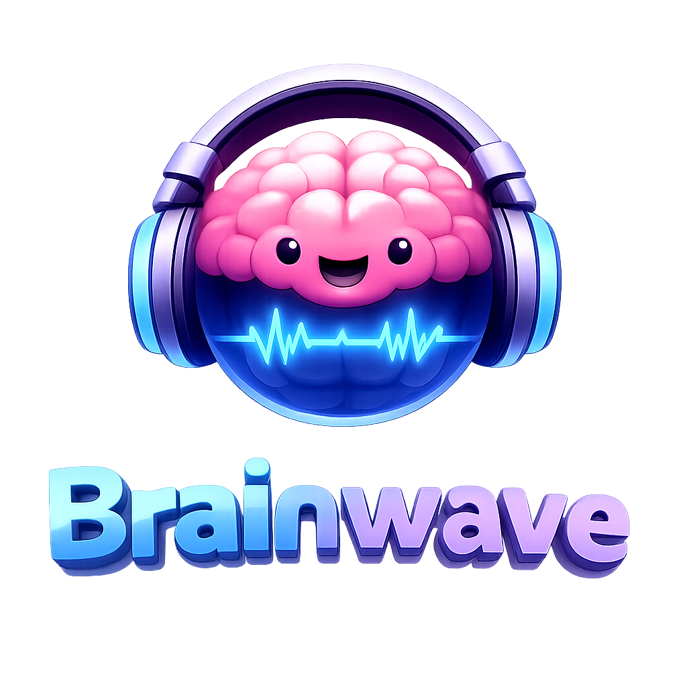
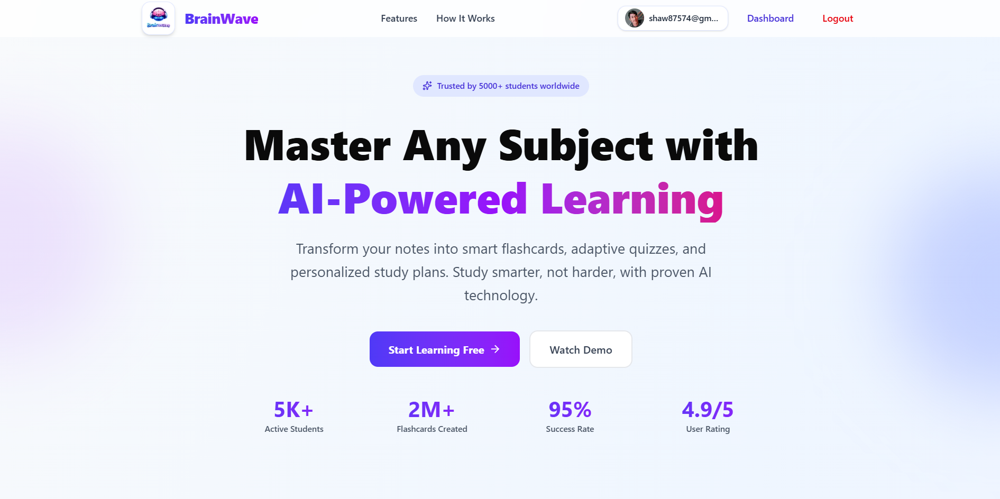
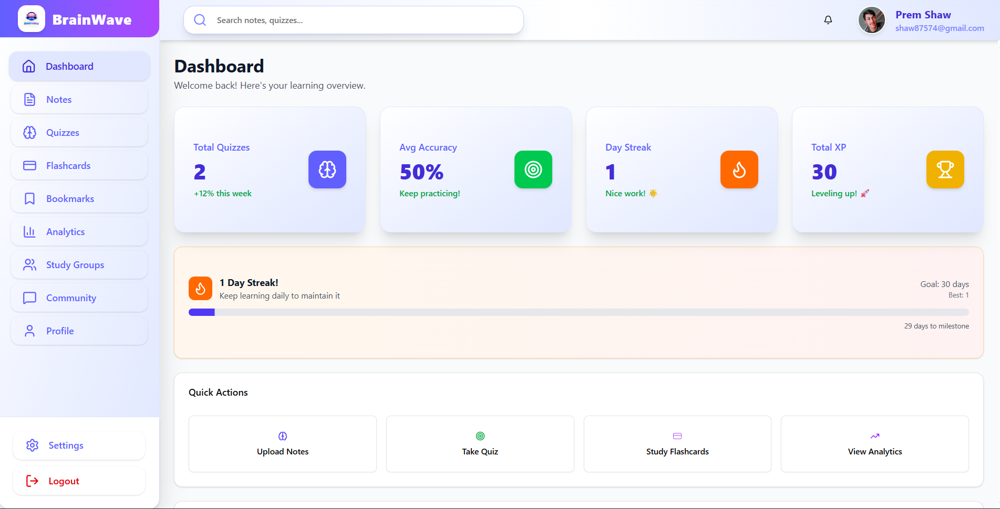
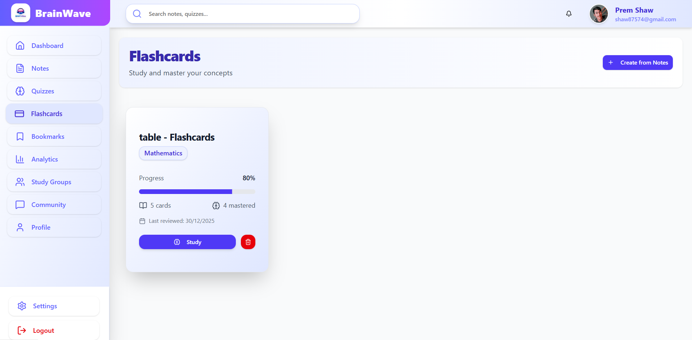
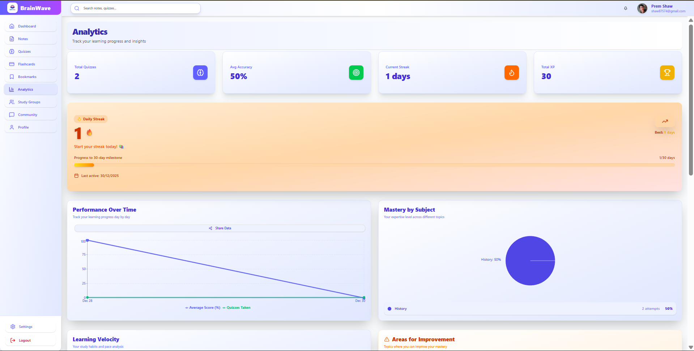
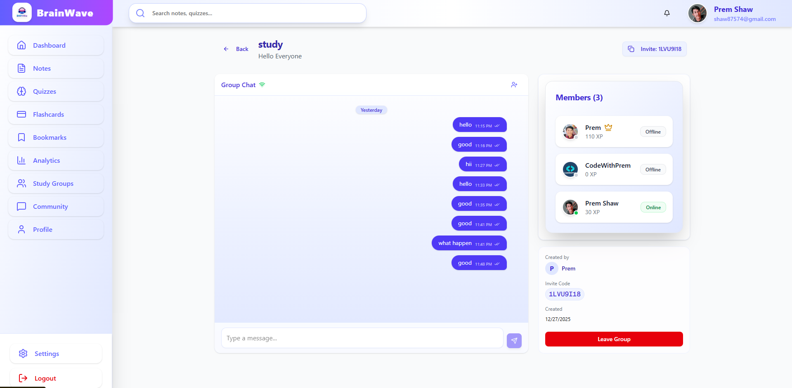

<p align="center">
  
</p>

# 🧠 BrainWave

**AI-Powered Learning Platform**

Transform your notes into smart flashcards, adaptive quizzes, and personalized study plans. Study smarter, not harder, with proven AI technology.

---

## 🌟 Features

- **AI Quiz & Flashcard Generation**: Upload notes or PDFs and instantly generate personalized quizzes and flashcards.
- **Real-time Collaboration**: Join study groups, chat live, and share resources.
- **Progress Analytics**: Track mastery, streaks, and learning velocity with beautiful charts.
- **Community Sharing**: Discover and share study materials with others.
- **Gamification**: Earn XP, climb leaderboards, and maintain daily streaks.
- **Secure Authentication**: Login with email or Google via Firebase.

---

## 🖥️ Tech Stack

| Frontend   | Backend         | Database      | Real-time   | AI         | Auth      | Deployment         |
|------------|----------------|--------------|-------------|------------|-----------|--------------------|
| Next.js 14 | Next.js API    | MongoDB Atlas| Socket.io   | OpenAI GPT | Firebase  | Vercel + Render    |
| React 18   | Express.js     |              |             |            |           |                    |
| TypeScript |                |              |             |            |           |                    |
| TailwindCSS|                |              |             |            |           |                    |

---

## 📦 Quick Start

```bash
git clone https://github.com/Premshaw23/brainwave
cd brainwave
npm install
cp .env.example .env.local
# Add your environment variables
npm run dev:all
```

---

## 📝 Usage

1. Register or login to your account
2. Upload notes or PDFs to generate quizzes/flashcards
3. Join study groups and collaborate in real-time
4. Track your progress and streaks on the dashboard
5. Share and discover materials in the community

---

## 📁 Folder Structure

```text
brainwave/
├── app/           # Next.js app router & API routes
├── components/    # UI and feature components
├── lib/           # Utility libraries (firebase, openai, etc.)
├── models/        # Mongoose schemas
├── server/        # Socket.io server
├── types/         # TypeScript types
├── public/        # Static assets
├── ...            # Configs, env, etc.
```

---

## 🔑 Environment Variables

See `.env.example` for all required variables:

```env
# MongoDB
MONGODB_URI=
# Firebase
NEXT_PUBLIC_FIREBASE_API_KEY=
NEXT_PUBLIC_FIREBASE_AUTH_DOMAIN=
NEXT_PUBLIC_FIREBASE_PROJECT_ID=
NEXT_PUBLIC_FIREBASE_STORAGE_BUCKET=
NEXT_PUBLIC_FIREBASE_MESSAGING_SENDER_ID=
NEXT_PUBLIC_FIREBASE_APP_ID=
FIREBASE_ADMIN_PROJECT_ID=
FIREBASE_ADMIN_CLIENT_EMAIL=
FIREBASE_ADMIN_PRIVATE_KEY=
# OpenAI
OPENAI_API_KEY=
# Socket.io
NEXT_PUBLIC_SOCKET_URL=http://localhost:3001
SOCKET_PORT=3001
# Security
JWT_SECRET=
NEXT_PUBLIC_APP_URL=http://localhost:3000
```

---

## 📸 Screenshots & Demo

<!-- Main UI Screenshots -->

### 🏠 Home Page


### 📊 Dashboard


### 🗂️ Flashcards


### 📈 Analytics


### 👥 Study Group


### 🌐 Live Demo

[https://brainwave-two-iota.vercel.app/](https://brainwave-two-iota.vercel.app/)

---

## 🎯 Roadmap & Future Enhancements

- Video study sessions
- AI tutoring chat
- Mobile app (React Native)
- Advanced analytics with ML predictions
- Collaborative note-taking

---

## 🤝 Contributing

Contributions, issues, and feature requests are welcome!<br>
Please read the [contributing guidelines](CONTRIBUTING.md) first.

---

## 📄 License

MIT

---

## 👤 Author

[Prem Shaw](https://github.com/Premshaw23)

---

## ✅ Deployment Checklist

### Pre-Launch
- [x] All features tested locally
- [x] No console.errors in production
- [x] All environment variables set
- [x] MongoDB indexes created
- [x] Firebase rules configured
- [x] Socket.io CORS updated
- [x] Images optimized
- [x] Bundle size checked
- [x] Mobile responsive tested
- [x] Loading states work
- [x] Error handling works

### Vercel Deployment
- [x] Repository pushed to GitHub
- [x] Vercel project created
- [x] Environment variables added
- [x] Build successful
- [x] Site accessible
- [x] No 404 errors
- [x] API routes working
- [x] Authentication working

### Render Deployment
- [x] Socket server deployed
- [x] Environment variables set
- [x] Health endpoint accessible
- [x] CORS configured
- [x] WebSocket connection works
- [x] Messages sent successfully

### Post-Launch
- [x] Test complete user flow
- [x] Multi-user testing
- [x] Mobile browser testing
- [x] Performance check (Lighthouse)
- [x] SEO basics done
- [x] Analytics set up (optional)
- [x] Domain configured (optional)